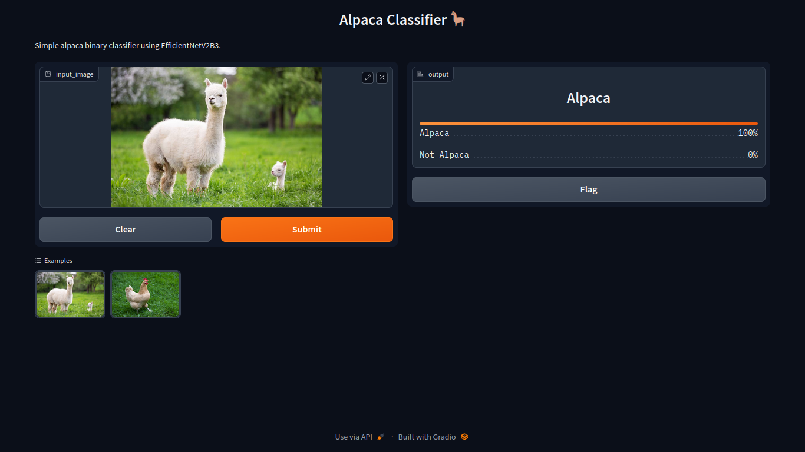

# alpaca-classifier-efficientnetv2b3

## Problem Domain
The main objective of this project is to classify images as either alpaca or non-alpaca.

## Solution
- Applied preprocessing techniques including data loading to import the images, data augmentation to create image variations, data standardization to normalize the image, and one-hot encoding.
- Utilized a simple convolutional neural network model achieving 72% accuracy and an EfficientNetV2 transfer learning model achieving 98% accuracy.

## Deployment
I use Gradio as deployment platform for demo purpose.

